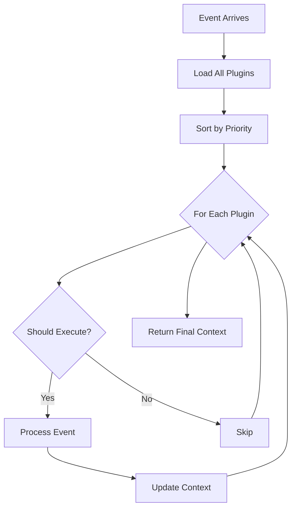

# Plugin Architecture Documentation

## Table of Contents
1. [Overview](#overview)
2. [Architecture Design](#architecture-design)
3. [Core Concepts](#core-concepts)
4. [Plugin System](#plugin-system)
5. [Event Processing Pipeline](#event-processing-pipeline)
6. [CLI Commands](#cli-commands)
7. [Plugin Development Guide](#plugin-development-guide)
8. [Examples](#examples)
9. [Best Practices](#best-practices)
10. [Technical Reference](#technical-reference)

---

## Overview

This project implements a **dynamic, event-driven plugin architecture** inspired by HashiCorp's plugin system (used in Terraform, Vault, etc.). The architecture enables:

- **Behavioral Extension**: Add new capabilities without modifying core code
- **Event Processing Pipeline**: Chain plugins together to process events
- **Auto-Discovery**: Automatically find and load plugins
- **Version Compatibility**: Ensure plugins work with the CLI version
- **GitHub Distribution**: Download and install plugins from GitHub releases

### Key Features

- 🔌 **Hot-pluggable**: Plugins are separate binaries loaded at runtime
- 🔄 **Event-driven**: Plugins react to events and enrich context
- 📦 **Self-contained**: Each plugin is a standalone executable
- 🔐 **Secure**: Uses gRPC with handshake validation
- 🎯 **Prioritized**: Plugins execute in defined order
- 🧩 **Composable**: Plugins work together through shared context

---

## Architecture Design

### System Components

```
┌─────────────────────────────────────────────────────┐
│                    CLI Application                   │
├─────────────────────────────────────────────────────┤
│                   Pipeline Manager                   │
├──────────────┬──────────────┬──────────────────────┤
│   Discovery  │   Loader     │   Version Check      │
├──────────────┴──────────────┴──────────────────────┤
│                  gRPC Communication                  │
└──────────────────────────────────────────────────────┘
                           │
        ┌──────────────────┼──────────────────┐
        │                  │                  │
    Plugin A           Plugin B          Plugin C
   (Priority: 10)    (Priority: 30)    (Priority: 50)
```

### Data Flow

```
Event → [Filter Plugin] → [Converter Plugin] → [Uploader Plugin] → Response
           ↓                    ↓                     ↓
        Adds metadata      Adds file_path      Adds upload_url
           to context         to context          to context
```

### Plugin Communication Protocol

The system uses **gRPC** over local sockets for plugin communication:

1. **Handshake**: Validates plugin compatibility
2. **Service Methods**:
   - `ShouldExecute`: Plugin decides if it should run
   - `Process`: Plugin processes the event
   - `GetMetadata`: Returns plugin information

---

## Core Concepts

### 1. Event

An **Event** represents an incoming message or trigger that flows through the plugin pipeline:

```go
type Event struct {
    Type      EventType              // message, command, webhook, scheduled
    Source    string                  // discord, telegram, slack, cli
    Content   string                  // The actual message/command
    UserID    string                  // User identifier
    ChannelID string                  // Channel/room identifier
    Metadata  map[string]interface{} // Additional event-specific data
}
```

### 2. Context

The **Context** carries the event and accumulated data through the pipeline:

```go
type Context struct {
    Event      Event                  // Original event
    Properties map[string]interface{} // Shared data between plugins
    Responses  []Response             // Accumulated plugin responses
}
```

### 3. Plugin Priority

Plugins execute in order based on their **priority** (lower numbers run first):

| Priority Range | Purpose | Examples |
|---------------|---------|----------|
| 0-20 | Input validation & filtering | Message filter, spam detector |
| 21-40 | Processing & transformation | Media converter, text processor |
| 41-60 | External services | File uploader, API caller |
| 61-80 | Post-processing | Notification, logging |
| 81-100 | Cleanup & finalization | Cache cleaner, temp file remover |

### 4. Execution Decision

Each plugin implements `ShouldExecute` to decide whether to process an event:

```go
type ExecutionDecision struct {
    ShouldExecute bool   // Whether to run
    Reason        string // Human-readable reason
}
```

---

## Plugin System

### Plugin Lifecycle

1. **Discovery**: CLI scans predefined paths for `plugin-*` binaries
2. **Loading**: Creates subprocess and establishes gRPC connection
3. **Validation**: Checks version compatibility
4. **Execution**: Calls plugin methods through RPC
5. **Cleanup**: Terminates subprocess when done

### Plugin Discovery Paths

Plugins are automatically discovered in these locations (in order):

1. `~/.local/share/plugins/` - User installations
2. `./plugins/` - Project-local plugins
3. `./.plugins/` - Hidden plugin directory
4. `$PLUGIN_PATH` - Environment variable paths
5. `/usr/local/lib/plugins/` - System-wide plugins

### Plugin Naming Convention

- Binary must start with `plugin-` prefix
- Example: `plugin-converter`, `plugin-uploader`
- The name after prefix becomes the plugin identifier

---

## Event Processing Pipeline

### Pipeline Execution Flow



### Context Enrichment Example

Consider processing: *"Please convert this video and upload it"*

```yaml
Initial Context:
  event:
    type: message
    content: "Please convert this video and upload it"
    source: discord

After Filter Plugin (Priority: 10):
  properties:
    action: convert
    media_type: video
    needs_upload: true

After Converter Plugin (Priority: 30):
  properties:
    action: convert
    media_type: video
    needs_upload: true
    file_path: /tmp/converted_123.mp4
    conversion_complete: true

After Uploader Plugin (Priority: 50):
  properties:
    action: convert
    media_type: video
    needs_upload: true
    file_path: /tmp/converted_123.mp4
    conversion_complete: true
    uploaded_url: https://s3.example.com/uploads/123.mp4
    upload_timestamp: 1234567890
```

---

## CLI Commands

### Root Command
```bash
plugin-cli [command]
```

### Version Management
```bash
# Show CLI version
plugin-cli version
```

### Plugin Management

#### List Plugins
```bash
plugin-cli plugin list
```
Shows all discovered plugins with their priority, version, and description.

Output:
```
NAME             PRIORITY   VERSION   DESCRIPTION
----             --------   -------   -----------
message-filter   10         1.0.0     Filters and categorizes messages
media-converter  30         1.0.0     Converts media files
s3-uploader      50         1.0.0     Uploads files to S3
```

#### Plugin Information
```bash
plugin-cli plugin info [plugin-name]
```
Displays detailed metadata about a specific plugin.

Output:
```json
{
  "name": "media-converter",
  "version": "1.0.0",
  "build_time": "2024-01-27T10:00:00Z",
  "min_cli_version": "1.0.0",
  "max_cli_version": "2.0.0",
  "description": "Converts media files to optimized formats",
  "priority": 30
}
```

#### Remove Plugin
```bash
plugin-cli plugin remove [plugin-name]
```
Removes an installed plugin from the system.

### Event Processing

#### Process Command
```bash
plugin-cli process [message] [flags]
```

Flags:
- `-s, --source`: Event source (discord, telegram, slack, cli)
- `-u, --user`: User ID
- `-c, --channel`: Channel ID
- `-t, --type`: Event type (message, command, webhook)
- `-m, --metadata`: Additional metadata as JSON

Example:
```bash
plugin-cli process "convert video.mp4 to webm" \
  --source discord \
  --user user123 \
  --channel general \
  --metadata '{"attachment_url": "http://example.com/video.mp4"}'
```

### Installation

#### Install from GitHub
```bash
plugin-cli install [owner/repo] [--version VERSION]
```

Examples:
```bash
# Install latest version
plugin-cli install acme/video-converter

# Install specific version
plugin-cli install acme/video-converter --version v2.1.0
```

### Simulation Commands

#### Simulate Discord Message
```bash
plugin-cli simulate discord
```
Runs a pre-configured Discord message through the pipeline.

#### Simulate Video Processing
```bash
plugin-cli simulate video
```
Simulates a complete video processing workflow.

---

## Plugin Development Guide

### Creating a New Plugin

#### 1. Implement the Plugin Interface

```go
package main

import (
    "context"
    "github.com/williamokano/hashicorp-plugin-example/shared"
)

type MyPlugin struct{}

// Decide whether to process this event
func (p *MyPlugin) ShouldExecute(ctx context.Context, context *shared.Context) shared.ExecutionDecision {
    // Check if this plugin should handle the event
    if context.Event.Type != shared.EventMessage {
        return shared.ExecutionDecision{
            ShouldExecute: false,
            Reason: "Only processes message events",
        }
    }
    
    // Check for required properties
    if _, hasAction := context.Properties["my_trigger"]; !hasAction {
        return shared.ExecutionDecision{
            ShouldExecute: false,
            Reason: "No trigger found",
        }
    }
    
    return shared.ExecutionDecision{
        ShouldExecute: true,
        Reason: "Ready to process",
    }
}

// Process the event
func (p *MyPlugin) Process(ctx context.Context, context *shared.Context) (*shared.Context, error) {
    // Read from context
    trigger := context.Properties["my_trigger"].(string)
    
    // Do your processing
    result := processData(trigger)
    
    // Add to context for other plugins
    context.Properties["my_result"] = result
    
    // Add response
    context.Responses = append(context.Responses, shared.Response{
        PluginName: p.Name(),
        Type:       "processing",
        Content:    "Processed successfully",
        Data: map[string]interface{}{
            "result": result,
            "timestamp": time.Now().Unix(),
        },
    })
    
    return context, nil
}

// Metadata methods
func (p *MyPlugin) Name() string { return "my-plugin" }
func (p *MyPlugin) Version() string { return "1.0.0" }
func (p *MyPlugin) BuildTime() string { return time.Now().Format(time.RFC3339) }
func (p *MyPlugin) MinCLIVersion() string { return "1.0.0" }
func (p *MyPlugin) MaxCLIVersion() string { return "2.0.0" }
func (p *MyPlugin) Description() string { return "My custom plugin" }
func (p *MyPlugin) Priority() int { return 25 } // Runs after filters, before uploaders
```

#### 2. Set Up the Plugin Server

```go
func main() {
    plugin.Serve(&plugin.ServeConfig{
        HandshakeConfig: shared.Handshake,
        Plugins: map[string]plugin.Plugin{
            "plugin": &shared.GRPCPlugin{Impl: &MyPlugin{}},
        },
        GRPCServer: plugin.DefaultGRPCServer,
    })
}
```

#### 3. Build and Install

```bash
# Build your plugin
go build -o plugin-myplugin main.go

# Install to plugin directory
cp plugin-myplugin ~/.local/share/plugins/
chmod +x ~/.local/share/plugins/plugin-myplugin

# Verify installation
plugin-cli plugin list
```

### Plugin Patterns

#### Pattern 1: Conditional Processor
```go
// Only processes if specific conditions are met
func (p *Plugin) ShouldExecute(ctx context.Context, context *shared.Context) shared.ExecutionDecision {
    // Check multiple conditions
    if !hasRequiredData(context) {
        return shared.ExecutionDecision{ShouldExecute: false}
    }
    if !isValidSource(context.Event.Source) {
        return shared.ExecutionDecision{ShouldExecute: false}
    }
    return shared.ExecutionDecision{ShouldExecute: true}
}
```

#### Pattern 2: Context Enricher
```go
// Adds data for downstream plugins
func (p *Plugin) Process(ctx context.Context, context *shared.Context) (*shared.Context, error) {
    // Enrich context with new data
    apiData := fetchFromAPI()
    context.Properties["api_data"] = apiData
    context.Properties["api_fetched"] = true
    return context, nil
}
```

#### Pattern 3: Chain Reactor
```go
// Reacts to data from previous plugins
func (p *Plugin) ShouldExecute(ctx context.Context, context *shared.Context) shared.ExecutionDecision {
    // Check if previous plugin has run
    if _, ok := context.Properties["previous_plugin_output"]; !ok {
        return shared.ExecutionDecision{
            ShouldExecute: false,
            Reason: "Waiting for previous plugin",
        }
    }
    return shared.ExecutionDecision{ShouldExecute: true}
}
```

---

## Examples

### Example 1: Text Translation Pipeline

```go
// 1. Language Detector Plugin (Priority: 10)
func (p *LanguageDetector) Process(ctx context.Context, context *shared.Context) (*shared.Context, error) {
    language := detectLanguage(context.Event.Content)
    context.Properties["source_language"] = language
    context.Properties["needs_translation"] = (language != "en")
    return context, nil
}

// 2. Translator Plugin (Priority: 20)
func (p *Translator) ShouldExecute(ctx context.Context, context *shared.Context) shared.ExecutionDecision {
    needsTranslation, _ := context.Properties["needs_translation"].(bool)
    return shared.ExecutionDecision{
        ShouldExecute: needsTranslation,
        Reason: "Translation required",
    }
}

func (p *Translator) Process(ctx context.Context, context *shared.Context) (*shared.Context, error) {
    translated := translateText(context.Event.Content)
    context.Properties["translated_text"] = translated
    return context, nil
}

// 3. Response Builder Plugin (Priority: 30)
func (p *ResponseBuilder) Process(ctx context.Context, context *shared.Context) (*shared.Context, error) {
    original := context.Event.Content
    translated, hasTranslation := context.Properties["translated_text"].(string)
    
    response := original
    if hasTranslation {
        response = fmt.Sprintf("Original: %s\nTranslated: %s", original, translated)
    }
    
    context.Responses = append(context.Responses, shared.Response{
        PluginName: p.Name(),
        Type:       "text",
        Content:    response,
    })
    return context, nil
}
```

### Example 2: Image Processing Pipeline

```yaml
Event: "Resize and watermark this image"

Pipeline:
1. Image Validator (Priority: 10)
   - Validates image format
   - Sets properties: image_valid, image_format

2. Image Resizer (Priority: 20)
   - Checks: image_valid == true
   - Resizes image
   - Sets: resized_path

3. Watermark Applier (Priority: 30)
   - Checks: resized_path exists
   - Applies watermark
   - Sets: watermarked_path

4. CDN Uploader (Priority: 40)
   - Checks: watermarked_path exists
   - Uploads to CDN
   - Sets: cdn_url

Result:
  properties:
    image_valid: true
    image_format: "jpeg"
    resized_path: "/tmp/resized_123.jpg"
    watermarked_path: "/tmp/watermarked_123.jpg"
    cdn_url: "https://cdn.example.com/images/123.jpg"
```

---

## Best Practices

### 1. Plugin Design

#### Do's:
- ✅ Make plugins **single-purpose** and focused
- ✅ Use **descriptive names** for properties
- ✅ **Document** expected input/output properties
- ✅ **Validate** inputs in ShouldExecute
- ✅ Handle **errors gracefully**
- ✅ Add **meaningful responses** for debugging

#### Don'ts:
- ❌ Don't modify properties unrelated to your plugin
- ❌ Don't assume execution order (use priority)
- ❌ Don't block for long operations (use async patterns)
- ❌ Don't panic - return errors instead

### 2. Context Properties

#### Naming Convention
```go
// Use descriptive, namespaced keys
context.Properties["converter_output_path"] = "/tmp/file.mp4"
context.Properties["converter_format"] = "mp4"
context.Properties["converter_success"] = true

// Not recommended
context.Properties["path"] = "/tmp/file.mp4"  // Too generic
context.Properties["f"] = "mp4"                // Too short
```

#### Type Safety
```go
// Always check types when reading properties
if val, ok := context.Properties["my_value"].(string); ok {
    // Safe to use val as string
} else {
    // Handle missing or wrong type
}
```

### 3. Priority Guidelines

```go
// Use constants for priority ranges
const (
    PriorityValidation  = 10
    PriorityProcessing  = 30
    PriorityExternal    = 50
    PriorityNotification = 70
    PriorityCleanup     = 90
)

func (p *MyPlugin) Priority() int {
    return PriorityProcessing + 5 // 35
}
```

### 4. Testing Plugins

```go
// Create test contexts
func TestPluginShouldExecute(t *testing.T) {
    plugin := &MyPlugin{}
    
    // Test case: Should execute
    ctx := &shared.Context{
        Event: shared.Event{
            Type: shared.EventMessage,
            Content: "test message",
        },
        Properties: map[string]interface{}{
            "required_property": "value",
        },
    }
    
    decision := plugin.ShouldExecute(context.Background(), ctx)
    assert.True(t, decision.ShouldExecute)
    
    // Test case: Should not execute
    ctx.Properties = map[string]interface{}{}
    decision = plugin.ShouldExecute(context.Background(), ctx)
    assert.False(t, decision.ShouldExecute)
}
```

---

## Technical Reference

### Protocol Buffer Definition

The system uses Protocol Buffers for gRPC communication:

```protobuf
service Plugin {
    rpc ShouldExecute(ContextProto) returns (ExecutionDecisionProto);
    rpc Process(ContextProto) returns (ContextProto);
    rpc GetMetadata(Empty) returns (Metadata);
}
```

### Handshake Configuration

```go
var Handshake = plugin.HandshakeConfig{
    ProtocolVersion:  1,
    MagicCookieKey:   "BASIC_PLUGIN",
    MagicCookieValue: "hello-plugin",
}
```

The handshake ensures only valid plugins can connect to the CLI.

### Version Compatibility

The system performs semantic version checking:

```go
// Plugin declares:
MinCLIVersion: "1.0.0"
MaxCLIVersion: "2.0.0"

// CLI version 1.5.0 ✅ Compatible
// CLI version 0.9.0 ❌ Too old
// CLI version 2.1.0 ❌ Too new
```

### Performance Considerations

1. **Plugin Loading**: Plugins are loaded on-demand and cached
2. **Parallel Execution**: Consider parallel processing for independent plugins
3. **Timeout Handling**: Implement timeouts for long-running operations
4. **Resource Management**: Plugins should clean up resources in defer blocks

### Security

1. **Process Isolation**: Each plugin runs in a separate process
2. **Handshake Validation**: Only plugins with correct handshake can connect
3. **No Direct Memory Access**: Plugins communicate only through gRPC
4. **Limited Filesystem Access**: Plugins have only their process permissions

---

## Troubleshooting

### Common Issues

#### Plugin Not Found
```bash
# Check discovery paths
plugin-cli plugin list

# Verify plugin is executable
ls -la ~/.local/share/plugins/plugin-*

# Check naming (must start with "plugin-")
mv myplugin plugin-myplugin
```

#### Version Incompatibility
```bash
# Check CLI version
plugin-cli version

# Check plugin requirements
plugin-cli plugin info [plugin-name]
```

#### Plugin Crashes
```bash
# Run with debug logging
PLUGIN_LOG_LEVEL=debug plugin-cli process "test"

# Check plugin logs
tail -f /tmp/plugin-*.log
```

### Debug Mode

Enable verbose logging:
```bash
export PLUGIN_LOG_LEVEL=debug
export GRPC_GO_LOG_VERBOSITY_LEVEL=99
export GRPC_GO_LOG_SEVERITY_LEVEL=info
```

---

## Future Enhancements

### Planned Features

1. **Plugin Marketplace**: Central repository for plugin discovery
2. **Hot Reload**: Reload plugins without restarting CLI
3. **Dependency Management**: Plugins can declare dependencies
4. **Event Routing**: Route specific events to specific plugins
5. **Plugin Composition**: Combine multiple plugins into workflows
6. **Metrics & Monitoring**: Track plugin performance and usage
7. **WebAssembly Support**: Run plugins in WASM sandbox
8. **Remote Plugins**: Load plugins from remote servers

### Contributing

To contribute a new plugin or feature:

1. Fork the repository
2. Create a feature branch
3. Implement your plugin following the guidelines
4. Add tests and documentation
5. Submit a pull request

---

## Conclusion

This plugin architecture provides a robust, extensible foundation for building complex event-processing systems. By following the patterns and practices outlined in this document, you can create powerful plugins that work seamlessly together in a pipeline, each adding its own behavior and capabilities to the system.

The key insight is that **plugins don't just process data in isolation** - they participate in a collaborative pipeline where each plugin's output becomes input for the next, creating emergent behavior from simple, composable parts.

---

*For more examples and the latest updates, visit the [GitHub repository](https://github.com/williamokano/hashicorp-plugin-example).*